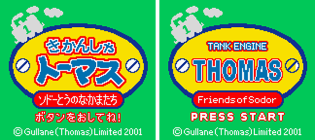
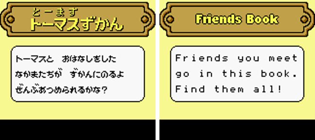
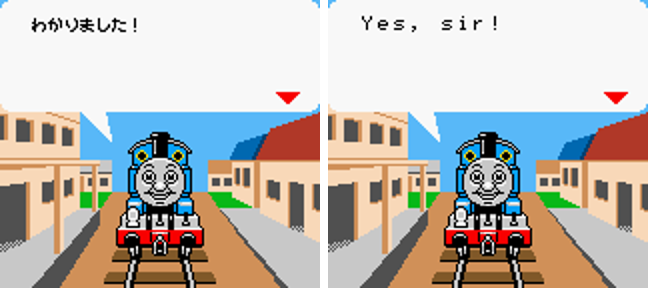
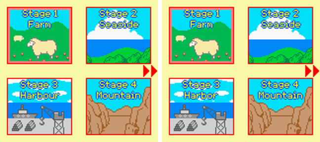
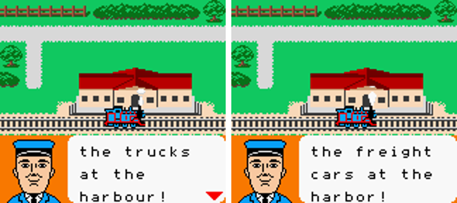
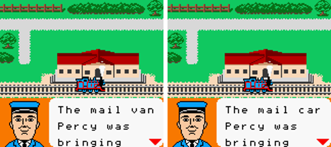
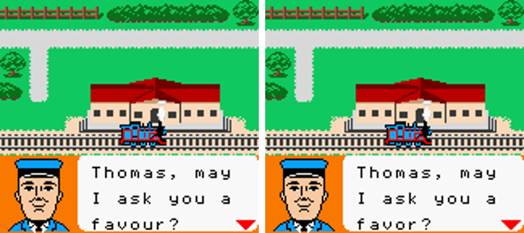

# Thomas the Tank Engine: Friends of Sodor — English translation

Fan translation of *Kikansha Thomas – Sodor-tou no Nakama-tachi* (きかんしゃトーマス ソドーとうのなかまたち;
Tamasoft, 2001), a Japan-only Game Boy Color game. The patch comes in two dubs:

- **UK:** trucks, mail van, level crossing, harbour
- **US:** freight cars, mail car, railroad crossing, harbor

Original Japanese on the left, US build on the right:

| | |
|---|---|
|  |  |
|  |  |

UK build on the left, US build on the right. The differences cover graphics as well as dialogue:

| | |
|---|---|
|  |  |
|  |  |

The dialogue frames come from `tools/dialogue_check.py`. It shows each message in the real
in-stage box but always over the stage-1 scene, so the portrait may not be the actual speaker.

## Status

- **Script:** all 151 messages are translated: story dialogue, the Friends Book (encyclopedia), system
  messages and the ending. Every story message has been checked in the real in-stage box for
  both dubs (`tools/dialogue_check.py`).
- **Graphics:** the title screen, menus, stage select, minigame HUDs and banners, the result
  pictures, the Friends Book plates, STAGE CLEAR, THE END and the "Game Boy Color only" screen are
  all redrawn in English. The search covered all 166 compressed graphics streams and the
  uncompressed copies.
- **Builds:** `just verify` checks that the Japanese script dumps and re-inserts byte for byte, and
  that each IPS/BPS patch reproduces its built ROM exactly.

## Playing the translation

You don't need Python or any of the build tools to play. You need a patch file from
[`patches/`](patches/), your own copy of the Japanese ROM and a web browser.
**The ROM is not included and must never be distributed.**

### 1. Pick a patch

| Patch | Dub | Use it if… |
|---|---|---|
| [`thomas-en-uk.bps`](patches/thomas-en-uk.bps) | UK | you want trucks, mail van, harbour |
| [`thomas-en-us.bps`](patches/thomas-en-us.bps) | US | you want freight cars, mail car, harbor |
| `thomas-en-uk.ips` / `thomas-en-us.ips` | | your patcher only supports IPS |

Use the **BPS** file if you can. BPS checks that your ROM is the right one before patching, while
IPS will silently patch a wrong ROM into one that doesn't work.

### 2. Check your ROM

The ROM must be the original Japanese release:

| | |
|---|---|
| File | `Kikansha Thomas - Sodor-tou no Nakama-tachi (Japan).gbc` |
| Size | 1,048,576 bytes (1 MiB) |
| SHA-1 | `8abd4406ec19bfecd6d675285fa73ef2d5ea622e` |
| CRC32 | `223bb19c` |

If it came as a `.zip`, unzip it first. Rom Patcher JS (step 3) shows the CRC32 and SHA-1 of the file
you load, so you can compare against this table.

### 3. Apply the patch in your browser

1. Open [Rom Patcher JS](https://www.marcrobledo.com/RomPatcher.js/). It runs entirely in the
   browser, so nothing is uploaded.
2. Under **ROM file**, choose the Japanese `.gbc`.
3. Under **Patch file**, choose the `.bps` (or `.ips`) you downloaded.
4. Click **Apply patch** and save the result, e.g. as `Thomas - Friends of Sodor (UK).gbc`.

Desktop alternatives: [Flips](https://github.com/Alcaro/Flips/releases) (Windows/Linux; also runs on
macOS under Wine) or [MultiPatch](https://projects.sappharad.com/tools/multipatch.html) (macOS).

### 4. Play

Load the patched `.gbc` in any Game Boy Color emulator (mGBA, SameBoy, Gambatte, RetroArch …) or
on a flash cart. The game only runs in Game Boy Color mode.

To confirm the patch applied correctly, compare your patched ROM with these:

| Patched ROM | SHA-1 | CRC32 |
|---|---|---|
| UK | `b4d4e3382d609e799a86e3731f60be1b4756dee1` | `e8d2de8b` |
| US | `c7f01e696329601fd49f90fc84c8aadc4d4517b9` | `d092ec5a` |

## Building from source

Requirements: [`uv`](https://docs.astral.sh/uv/), [`just`](https://github.com/casey/just),
[`rgbds`](https://rgbds.gbdev.io/) (`brew install rgbds`), and a C++ compiler (to build Flips).
Copy the clean ROM to `rom/thomas-jp.gbc`, then run:

```sh
just setup     # one-time: fetch/build Flips + mgbdis, install Python deps
just check     # validate the English script (line widths, glyph limits, space budget)
just build     # out/thomas-en-uk.gbc + out/thomas-en-us.gbc
just patch     # out/thomas-en-{uk,us}.{ips,bps}, copied to patches/
just verify    # JP round-trip + every patch reproduces its built ROM
just review    # script/review.md: JP / UK / US side by side, wrapped as in-game
just save      # all-unlocked battery saves (out/thomas-en-{uk,us}.srm) for testing
just gfx       # regenerate the English artwork from its make.py scripts
```

`rom/`, `out/` and `vendor/` are gitignored, so no ROM or built ROM is committed. The repo
does contain material extracted from the game for reference: the Japanese script in
`script/dialogue.yaml` and the original artwork (`original.png`, `*.orig.png`) next to each
English replacement.

## Editing the translation

- **`script/dialogue.yaml`** holds every message, with the Japanese (`jp`) and English (`en`).
  English is plain prose and the build word-wraps it for the box it appears in. `\n` forces a line
  break and `<PAGE>` starts a new text box.
- **`script/glossary.yaml`** holds UK/US wording. In the script, `{trucks}` becomes *trucks* or
  *freight cars*, `{Trucks}` capitalises it, and an inline `{uk|us}` handles one-off differences.
- **`gfx/font_en.txt`** is the editable 8×8 English font.
- **`gfx/screens/*/make.py`** and **`gfx/streams/make.py`** generate the English artwork. Each
  `*.orig.png` / `original.png` next to it is the Japanese art it replaces.

Layout limits that `just check` enforces:

- Dialogue wraps at 12/12/11 characters. Some messages show in a cutscene box and some in the
  in-stage portrait box, and the narrower of the two sets the width.
- A message can use at most 89 distinct characters; the game's font loader hangs past that.
- The repacked script must fit in 9,648 bytes. Each dub currently uses about 90%.

## How it works

`notes/re-notes.md` documents the ROM internals: the text encoding, the pointer table and
per-message font loader, the LZSS graphics format, screen asset lists, code-drawn sprite banners
and the free banks used for new data. In brief:

- **Text:** `tools/insert_text.py` wraps and pages the English, repacks the bank-`$12` script and
  pointer table, and installs the English font. The game loads glyphs per message, so a
  fixed-width English font needed no code changes.
- **Graphics:** `tools/lz.py` reimplements the game's LZSS codec; its greedy encoder matches the
  original stream sizes. New streams go into free banks 9–13, and the screen asset lists are
  repointed to them. A retiler keeps the original tilemap entries for unchanged cells, so palettes
  still line up.
- **Testing:** headless [PyBoy](https://github.com/Baekalfen/PyBoy) scripts drive the game.
  `tools/playtest.py` makes contact sheets, `tools/explore.py` explores stages and minigames, and
  `tools/dialogue_check.py` renders every message in its real box and flags overflow.

## Development-only helpers

`just play <scene> [us|uk]` (`tools/dev/play.py`) rebuilds the ROM and opens it in a PyBoy window
at a scene that is slow to reach by hand, e.g. `just play stage-clear`. It is a testing aid only.
The build and the patches don't use it, and you can delete it (`tools/dev/` plus the "DEV ONLY"
section of the justfile).

## Credits

- Original game © Gullane (Thomas) Limited 2001, developed by Tamasoft. This is an unofficial fan
  project with no affiliation to the rights holders.
- Tools: [Flips](https://github.com/Alcaro/Flips), [mgbdis](https://github.com/mattcurrie/mgbdis),
  [RGBDS](https://rgbds.gbdev.io/), [PyBoy](https://github.com/Baekalfen/PyBoy).

Distribute the patch files only, never the ROM.
